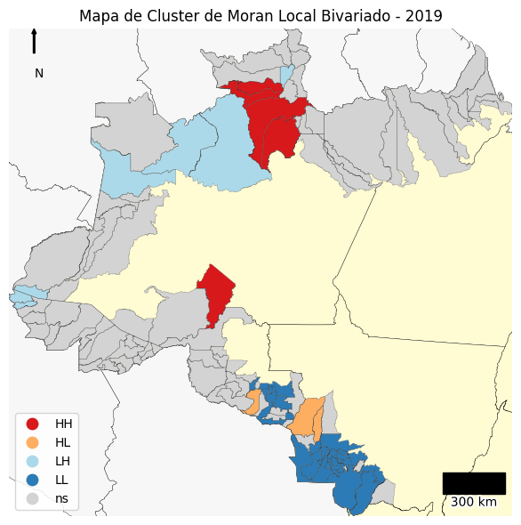
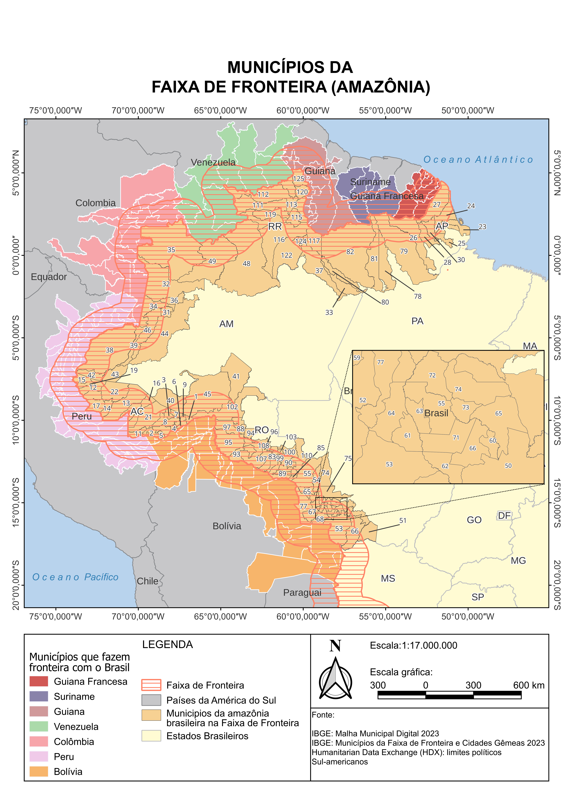
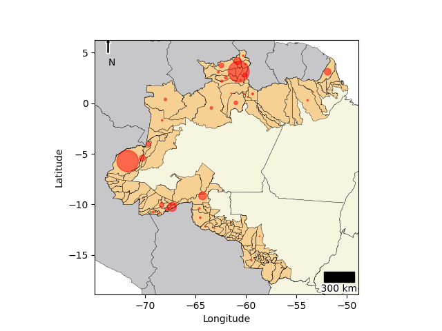
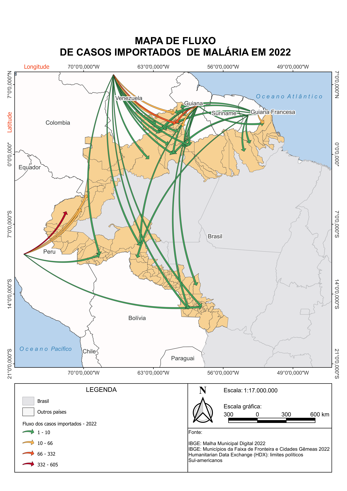
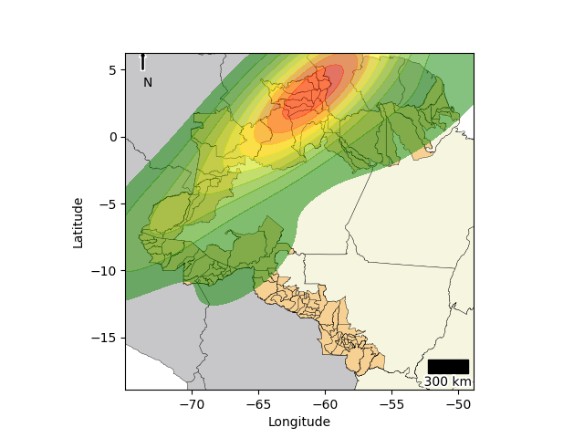
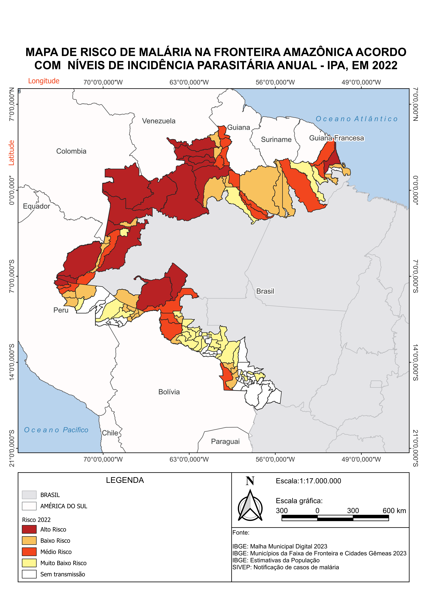
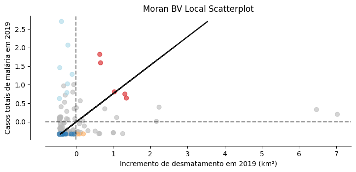

# Malaria Data Analysis

Este repositório contém um pipeline completo para análise de dados de malária, desde a extração de dados em arquivos PDF, transformação e análise, até a geração de mapas geoespaciais. O projeto foi criado para consolidar informações de mais de 1000 arquivos e apresentar resultados visuais que auxiliam na tomada de decisão em saúde pública.

---

## Estrutura do Projeto

```plaintext
malaria-data-analysis/
│
├── analysis/
│   ├── datasets/
│   │   └── consolidated_data.xlsx        # Dados consolidados para análise
│   └── notebook_de_analise_de_dados.ipynb # Notebook para análise dos dados
│
├── etl/
│   ├── example_pdfs/
│   │   └── ACRELÂNDIA 2015.pdf           # Exemplo de arquivo PDF para ETL
│   ├── output/                           # Resultados intermediários do ETL
│   ├── scripts/                          # Scripts auxiliares
│   └── notebook_de_ETL.ipynb             # Notebook para ETL
│
├── maps/
│   ├── map_outputs/
│   │   ├── autocorrelacao_espacial_moran_2019.png
│   │   ├── caracterizacao_area_estudo.png
│   │   ├── casos_positivos_2022.png
│   │   ├── mapa_fluxo_casos_importados_2022.png
│   │   ├── Estimativa_de_densidade_de_Kernel_paleta_2_2017.png
│   │   ├── Mapa_de_Risco_2022.png
│   │   └── Moran_BV_Local_Scatterplot_2019.png
│   └── notebook_de_geracao_de_mapas.ipynb # Notebook para geração de mapas
│
├── LICENSE                               # Licença do projeto
└── README.md                             # Documentação do repositório
```

---

## Objetivo

Este projeto tem como objetivo:

1. **Extrair dados de arquivos PDF**: Arquivos contendo informações sobre casos de malária em diferentes localidades.
2. **Transformar os dados**: Organizar, consolidar e preparar os dados para análise.
3. **Analisar e correlacionar**: Explorar padrões e realizar análises estatísticas.
4. **Gerar visualizações e mapas geoespaciais**: Criar mapas para identificar padrões de distribuição e fatores associados aos casos.

---

## Notebooks

### 1. **ETL (Extract, Transform, Load)**
- Localização: `etl/notebook_de_ETL.ipynb`
- Descrição: Este notebook processa os arquivos PDF e transforma os dados em uma estrutura consolidada para análise.

### 2. **Análise de Dados**
- Localização: `analysis/notebook_de_analise_de_dados.ipynb`
- Descrição: Realiza análises descritivas, estatísticas e apresenta insights sobre os dados de malária.

### 3. **Geração de Mapas**
- Localização: `maps/notebook_de_geracao_de_mapas.ipynb`
- Descrição: Cria mapas geoespaciais baseados nos dados analisados, incluindo mapas de risco e de densidade.

---

## Mapas Resultantes

Aqui estão alguns mapas gerados pelo projeto:

1. **Autocorrelação Espacial (Moran's I)**
   

2. **Caracterização da Área de Estudo**
   

3. **Casos Positivos (2022)**
   

4. **Fluxo de Casos Importados (2022)**
   

5. **Estimativa de Densidade (Kernel)**
   

6. **Mapa de Risco (2022)**
   

7. **Scatterplot Local Moran's I**
   

---

## Requisitos

- **Python**: Versão 3.8 ou superior
- **Bibliotecas**:
  - `pandas`
  - `numpy`
  - `matplotlib`
  - `seaborn`
  - `geopandas`
  - `shapely`
  - `pdfplumber`

---

## Como Executar

1. Clone o repositório:
   ```bash
   git clone https://github.com/samuel-c-santos/malaria-data-analysis.git
   cd malaria-data-analysis
   ```

2. Instale as dependências:
   ```bash
   pip install -r requirements.txt
   ```

3. Execute os notebooks na ordem:
   - `etl/notebook_de_ETL.ipynb`
   - `analysis/notebook_de_analise_de_dados.ipynb`
   - `maps/notebook_de_geracao_de_mapas.ipynb`

---

## Licença

Este projeto está licenciado sob a [MIT License](LICENSE).

---
